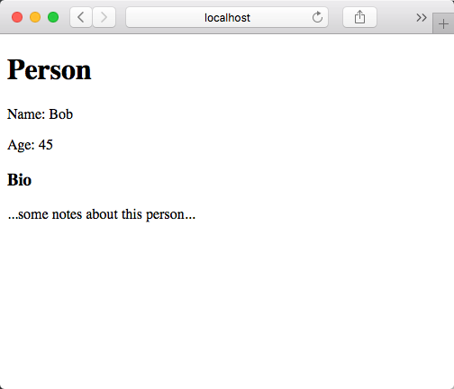

# complate sample using HTTP4k

    
This sample demonstrates the usage of [complate](https://github.com/complate) as a templating engine for 
[HTTP4K](https://http4k.org) (a Kotlin based HTTP toolkit). Therefore, this demo project makes use of the 
[complate-http4k](https://github.com/complate/complate-http4k) adapter.

## Setup

**Pre**  
Please download, build and install [complate-http4k](https://github.com/complate/complate-http4k) locally. As mentioned
above, the library get's not published to MavenCentral at the moment. 
  
  
Starting the application:
  
1. installing dependencies: `./gradlew npmInstall`
2. build the templates: `npm run compile`
3. start the server: `./gradlew build run`
  
The test routing "/person" is available under [http://localhost:9000/person](http://localhost:9000/person)

You should see something like this:   

  
  
NOTE: as you see, you'll need to have a _Java_, _Gradle_ and _npm_ running on your device. 

## Templates

The templates are located in the `src/main/frontend/views` folder. To enable live compilation of the templates,
you'll need to start another process beside the running server:

    npm start compile

Any changes to the source templates will be compiled directly and should take effect immediately.
